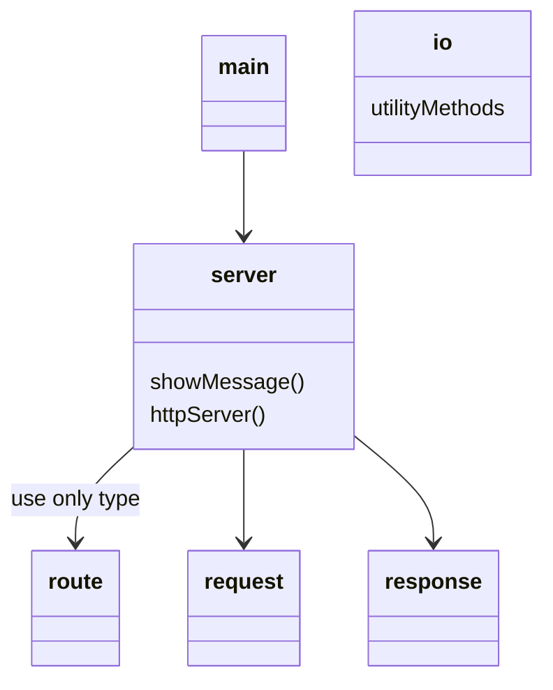

### request

- GET

```bash
curl -i http://127.0.0.1:8080/
```

- POST

```bash
curl -X POST -H "Content-Type: application/json" -d '{"id":"3", "name":"hoge"}' http://127.0.0.1:8080/
```


```mermaid
classDiagram

class server {
    showMessage()
    httpServer() <!-- use request and response -->
}

main --> server
server --> route : use only type
server --> request
server --> response

class io {
    utilityMethods
}
```
